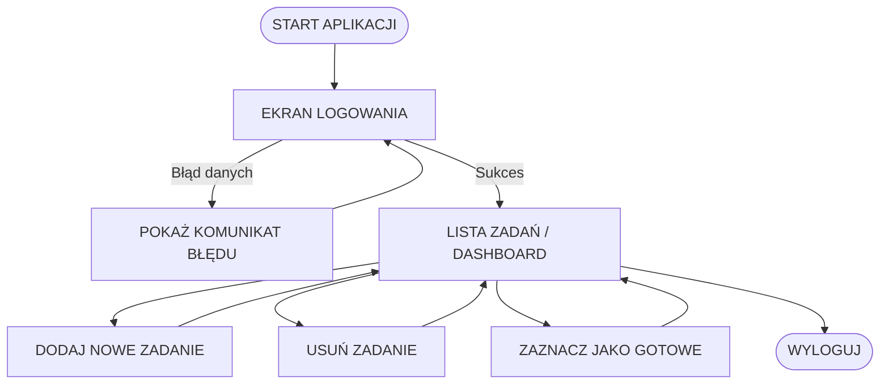

# 🔀 Schemat działania aplikacji (Flowchart)

Poniższy diagram przedstawia ścieżkę użytkownika w aplikacji:

```mermaid
graph TD
    A([START APLIKACJI]) --> B[EKRAN LOGOWANIA]
    
    B -- Błąd danych --> C[POKAŻ KOMUNIKAT BŁĘDU]
    C --> B
    
    B -- Sukces --> D[LISTA ZADAŃ / DASHBOARD]
    
    D --> E[DODAJ NOWE ZADANIE]
    D --> F[USUŃ ZADANIE]
    D --> G[ZAZNACZ JAKO GOTOWE]
    
    E --> D
    F --> D
    G --> D
    
    D --> H([WYLOGUJ])
```